<div align="center">
  
  
  # @git-franckg/sveltekit-forms
  
  <p align="center">
    A reactive form management library for SvelteKit with type-safe validation, built-in accessibility, and automatic error handling using Svelte 5's latest features.
  </p>
  
  <p align="center">
    <a href="https://www.npmjs.com/package/@git-franckg/sveltekit-forms">
      
    </a>
    <a href="https://www.npmjs.com/package/@git-franckg/sveltekit-forms">
      
    </a>
    <a href="https://github.com/git-franckg/sveltekit-forms/blob/master/LICENSE">
      
    </a>
    
    
    
  </p>
</div>

## Features

- 🎯 **Type-safe** - Full TypeScript support with proper inference
- ⚡ **Reactive validation** - Real-time validation using Svelte 5 runes
- 🔌 **Standard Schema compatible** - Works with Valibot, Zod, and other validation libraries
- ♿ **Accessible by default** - Automatic ARIA attributes management
- 🎨 **Flexible error display** - Smart error visibility timing
- 🔧 **Union type support** - Handle discriminated unions with the `fixed()` method
- 🚀 **Multi-step forms** - Built-in support for complex form flows with the `Participant` class

## Installation

```bash
npm install @git-franckg/sveltekit-forms
# or
yarn add @git-franckg/sveltekit-forms
# or
pnpm add @git-franckg/sveltekit-forms
```

## Quick Start

```typescript
// +page.ts
import { Form } from '@git-franckg/sveltekit-forms';
import { object, string, pipe, email, minLength } from 'valibot';

export const load = () => {
  const form = new Form(
    {
      schema: object({
        email: pipe(string(), email()),
        password: pipe(string(), minLength(8))
      }),
      behavior: {
        email: {},
        password: {}
      }
    },
    { email: '', password: '' },
    (output) => {
      console.log('Form submitted:', output);
    }
  );

  return { form };
};
```

```svelte
<!-- +page.svelte -->
<script lang="ts">
  const { data } = $props();
  $effect(() => data.form.tick());
</script>

<form>
  <label {@attach data.form.behaviors.email.label}>Email</label>
  <input bind:value={data.form.input.email} {@attach data.form.behaviors.email.input} />
  <p {@attach data.form.behaviors.email.error}>
    {data.form.behaviors.email.issueText?.[0]}
  </p>

  <button type="button" onclick={data.form.submit}>Submit</button>
</form>
```

## Library Architecture

```mermaid
graph TB
    subgraph "Form Instance"
        Form["Form&lt;T&gt;<br/>• input: T (reactive state)<br/>• behaviors: Record&lt;key, Behavior&gt;<br/>• issues: FlattenedIssues | null"]
    end

    subgraph "Validation Flow"
        Schema["Standard Schema<br/>(Valibot, Zod, etc.)"]
        Validate["validate(input)"]
        Issues["Issues<br/>• formIssues[]<br/>• fieldIssues{}"]
    end

    subgraph "Behavior System"
        Behavior["Behavior<br/>• issueText<br/>• issueShown<br/>• touched"]
        Attachments["Attachments<br/>• input()<br/>• label()<br/>• error()<br/>• caption()"]
        DOM["DOM Elements<br/>with ARIA attributes"]
    end

    subgraph "User Interaction"
        UserInput["User Input"]
        Events["Events<br/>• oninput<br/>• onchange<br/>• onblur"]
    end

    Form -->|"$derived"| Validate
    Schema --> Validate
    Validate --> Issues
    Issues -->|"tick()"| Behavior

    Behavior --> Attachments
    Attachments -->|"@attach"| DOM

    UserInput --> Events
    Events -->|"Update"| Form
    Events -->|"Toggle visibility"| Behavior

    Form -->|"submit()"| Schema
    Schema -->|"Valid"| Success["onSubmit callback"]
    Schema -->|"Invalid"| ShowErrors["Show all errors"]

    style Form fill:#e1f5fe
    style Behavior fill:#f3e5f5
    style Schema fill:#e8f5e9
    style DOM fill:#fff3e0
```



## Multi-Step Form Flow with Participant

```mermaid
graph LR
    subgraph "Layout Load"
        P[Participant Instance<br/>• Config with forms<br/>• Flow order<br/>• Navigation adapter]
    end

    subgraph "Form Steps"
        F1[Form 1: Account<br/>email, password]
        F2[Form 2: Profile<br/>name, bio]
        F3[Form 3: Preferences<br/>settings]
    end

    subgraph "Participant State"
        Input[participant.input<br/>{ account: {...},<br/>profile: {...},<br/>preferences: {...} }]
    end

    subgraph "Navigation"
        Route1[/signup/account]
        Route2[/signup/profile]
        Route3[/signup/preferences]
        EndRoute[/signup/complete]
    end

    P -->|"set('account')"| F1
    P -->|"set('profile')"| F2
    P -->|"set('preferences')"| F3

    F1 -->|submit()| Input
    F2 -->|submit()| Input
    F3 -->|submit()| Input

    Route1 -->|Form 1 Success| Route2
    Route2 -->|Form 2 Success| Route3
    Route3 -->|Form 3 Success| EndRoute

    F1 -.->|Creates| Form[Form Instance<br/>with validation]
    F2 -.->|Creates| Form
    F3 -.->|Creates| Form

    Input -->|Persists across<br/>navigation| Input

    style P fill:#e1f5fe
    style Input fill:#f3e5f5
    style EndRoute fill:#c8e6c9
```

## User Interaction Flow


## API Reference

### Form Class

```typescript
class Form<T extends FormInput> {
  input: T; // Reactive form data
  behaviors: Record<keyof T, Behavior>; // Field behaviors
  issues: FlattenedIssues<T> | null; // Current validation errors

  constructor(config: FormConfig<T>, initialValue: T, onSubmit: (output: T) => void);

  submit(): void; // Validate and submit form
  tick(): void; // Update field errors
  fixed<TFixed>(fixedInput: TFixed): Form<Extract<T, TFixed>>;
}
```

### Behavior Class

The Behavior class manages individual field UI behavior and accessibility:

- **Automatic error timing**: Errors hide during typing, show on blur/change
- **Touch state tracking**: Prevents showing errors on untouched fields
- **ARIA attributes**: Automatically manages `aria-invalid`, `aria-errormessage`, etc.

### Attachments

Use the `{@attach}` directive to connect behaviors to DOM elements:

```svelte
<label {@attach form.behaviors.email.label}>Email</label>
<input {@attach form.behaviors.email.input} />
<span {@attach form.behaviors.email.caption}>Optional helper text</span>
<p {@attach form.behaviors.email.error}>Error message here</p>
```

## Advanced Usage

### Working with Union Types

```typescript
type FormInput =
  | { type: 'login'; email: string; password: string }
  | { type: 'register'; email: string; password: string; confirmPassword: string };

// In your component
const form = data.form.fixed({ type: 'register' });
// Now TypeScript knows about confirmPassword field
```

### Custom Validation Messages

```typescript
const schema = object({
  email: pipe(string('Email is required'), email('Please enter a valid email'))
});
```

### Programmatic Field Updates

```typescript
// Update a field value
form.input.email = 'new@email.com';

// Mark field as touched
form.behaviors.email.touched = true;
form.behaviors.email.issueShown = true;
```

## Multi-Step Forms with Participant

The `Participant` class enables you to build complex multi-step form workflows, such as checkout processes, registration wizards, or surveys. It manages form state across navigation and automatically progresses through your defined flow.

### Setting Up a Multi-Step Form

```typescript
// +layout.ts
import { Participant } from '@git-franckg/sveltekit-forms';
import { goto } from '$app/navigation';
import { object, string, pipe, email, minLength } from 'valibot';

export const load = () => {
  const participant = new Participant({
    forms: {
      account: {
        schema: object({
          email: pipe(string(), email()),
          password: pipe(string(), minLength(8))
        }),
        behavior: { email: {}, password: {} },
        route: '/signup/account'
      },
      profile: {
        schema: object({
          firstName: string(),
          lastName: string(),
          bio: string()
        }),
        behavior: { firstName: {}, lastName: {}, bio: {} },
        route: '/signup/profile'
      },
      preferences: {
        schema: object({
          newsletter: boolean(),
          notifications: boolean()
        }),
        behavior: { newsletter: {}, notifications: {} },
        route: '/signup/preferences'
      }
    },
    flow: ['account', 'profile', 'preferences'],
    endRoute: '/signup/complete',
    navigate: goto
  });

  return { participant };
};
```

### Using Participant in Form Pages

```svelte
<!-- /signup/profile/+page.svelte -->
<script lang="ts">
  const { data } = $props();

  // Create a form for this step with default values
  const form = data.participant.set('profile', {
    firstName: '',
    lastName: '',
    bio: ''
  });

  $effect(() => form.tick());
</script>

<form>
  <h1>Step 2: Your Profile</h1>

  <label {@attach form.behaviors.firstName.label}>First Name</label>
  <input {@attach form.behaviors.firstName.input} bind:value={form.input.firstName} />
  <p {@attach form.behaviors.firstName.error}>{form.behaviors.firstName.issueText?.[0]}</p>

  <label {@attach form.behaviors.lastName.label}>Last Name</label>
  <input {@attach form.behaviors.lastName.input} bind:value={form.input.lastName} />
  <p {@attach form.behaviors.lastName.error}>{form.behaviors.lastName.issueText?.[0]}</p>

  <label {@attach form.behaviors.bio.label}>Bio</label>
  <textarea {@attach form.behaviors.bio.input} bind:value={form.input.bio}></textarea>
  <p {@attach form.behaviors.bio.error}>{form.behaviors.bio.issueText?.[0]}</p>

  <button type="button" onclick={form.submit}>Continue</button>
</form>
```

### Accessing Accumulated Data

```svelte
<!-- /signup/complete/+page.svelte -->
<script lang="ts">
  const { data } = $props();
  // Access all collected data
  const allData = data.participant.input;
</script>

<h1>Registration Complete!</h1><pre>{JSON.stringify(allData, null, 2)}</pre>
```

### Participant API

```typescript
class Participant<T extends ParticipantInput> {
  // Accumulated form data from all steps
  readonly input: Partial<T>;

  // Create a Form instance for a specific step
  set<K extends keyof T>(form: K, defaultValue: T[K]): Form<T[K]>;
}

// Configuration interface
type ParticipantConfig<T> = {
  forms: {
    [K in keyof T]: FormConfig<T[K]> & {
      route: string; // URL for this form step
    };
  };
  endRoute: string; // Destination after completing all forms
  flow: (keyof T)[]; // Order of form progression
  navigate: (route: string) => Promise<void>; // Navigation function
};
```

### Key Benefits

- **Persistent State**: Form data is preserved across navigation
- **Type Safety**: Full TypeScript support for all form steps
- **Automatic Flow**: No manual navigation logic needed
- **Flexible**: Each form can have its own validation rules and behaviors
- **Progressive Enhancement**: Works with browser back/forward navigation

## Browser Support

Requires browsers with support for:

- Svelte 5 (Chrome/Edge 84+, Firefox 75+, Safari 14.1+)
- ES2020 features

## Contributing

Contributions are welcome! Please feel free to submit a Pull Request.

## License

MIT

## Credits

Built with [Svelte 5](https://svelte.dev) and [Standard Schema](https://github.com/standard-schema/standard-schema).
